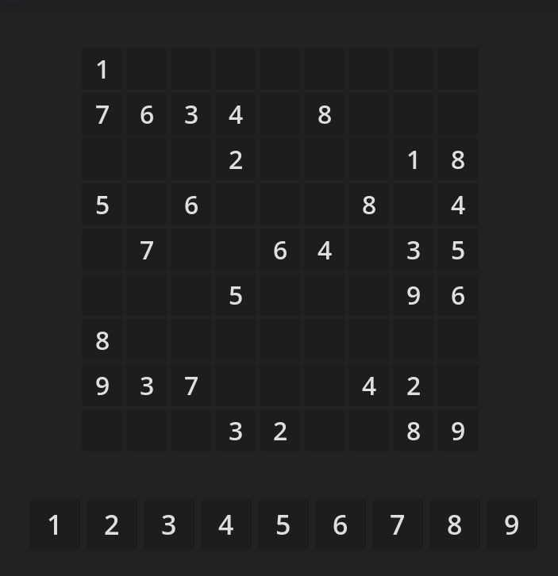
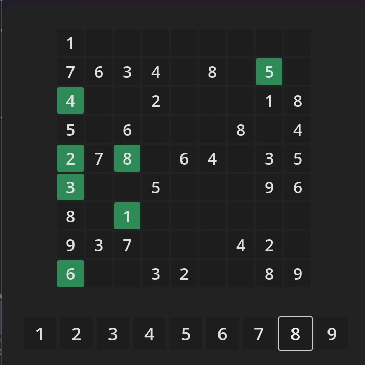

# Sudoku in Godot 4

This project is a fully functional Sudoku game built using the Godot 4 engine. It includes a puzzle generator, solver, and a user-friendly interface for playing Sudoku puzzles of varying difficulties.

The game is designed as part of a YouTube tutorial. Check out the complete video in my [YouTube channel](https://www.youtube.com/@TheWizardCoder).

## Highlights

- Random Sudoku Puzzle Generation: Generates valid and unique Sudoku puzzles with adjustable difficulty levels (Easy, Medium, Hard).
- Hint System: Get hints to assist in solving challenging puzzles.
- Validation: Ensures the player's solution adheres to Sudoku rules in real time.

## Screenshots

