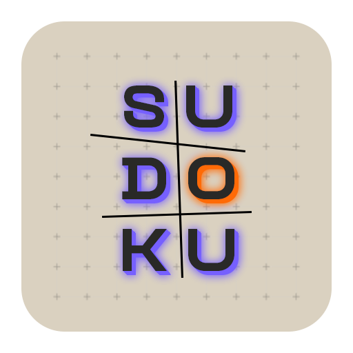
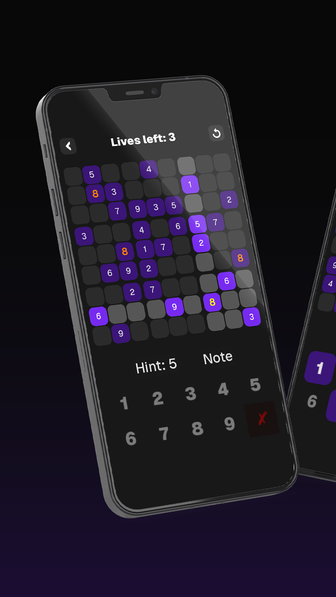
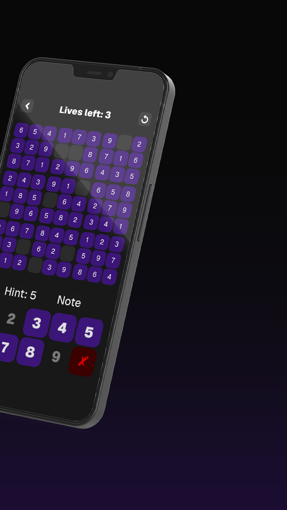

    
    <h1><b>Sudooku</b></h1>
    
<i>A sleek, modern Sudoku experience built with Godot 4</i>

  

    
    
    
    
    
  

  

---

## 🎮 About The Project
**Sudooku** is a fully functional Sudoku game developed using the **Godot 4** engine. This project features a robust puzzle generator, an intelligent hint system, and a highly polished UI designed for mobile play. 

> [!NOTE]
> This is a fork with major enhancements. Credit to the original creator for the foundation.

> [!TIP]
> **Enjoying the project?** Give it a ⭐ star to show your support and help others discover it!

## ✨ Key Features
- **Dynamic Generation**: Creates unique, valid puzzles with a backtracking algorithm to ensure a single solution.
- **Note Mode (Pencil Marks)**: A complex sub-grid system allowing players to track possibilities within a cell.
- **Intelligent Highlighting**: Real-time highlighting of rows, columns, 3x3 sub-grids, and matching numbers to aid visualization.
- **Smart Numpad**: Buttons automatically disable once all 9 instances of a digit are correctly placed on the board.
- **Multi-Tier Hint System**: Includes Random hints and "Hardest Cell" logic to help you get unstuck.
- **Difficulty Scaling**: Choose from Simple to Master levels, affecting the number of pre-filled cells.

## 🎥 Development Journey
The development of Sudooku was documented in two major phases:

  
  

1. **[How I Made My First Game with Godot](https://youtu.be/pNoVTjTCaYE)**: Exploring Godot for the first time, learning GDScript, and setting up the foundations.
2. **[Building Sudoku vs The World’s Hardest Puzzle](https://youtu.be/CXRPVB1d9l0)**: Implementing the core logic, Note Mode, and the final polish for the Play Store.

## 📸 Screenshots

  
  

## 🛠️ Built With
* [Godot Engine 4.x](https://godotengine.org/) - Game Engine
* [GDScript](https://docs.godotengine.org/en/stable/tutorials/scripting/gdscript/gdscript_basics.html) - Programming Language

## 🤝 Contributing
This project is **open source**! I'd love to see the community add features like:
- [ ] A Global Timer & Scoring System
- [ ] Multiplayer "Speed Solve" mode

Feel free to fork the repo and submit a Pull Request.

Found a bug? Have a feature request? [Open an issue](https://github.com/ba6ul/sudooku/issues)!

## ⚖️ License

- **Source Code**: GNU General Public License v3.0 (GPL-3.0)
- **Branding & Assets**: All Rights Reserved

This repository contains the source code for a Sudoku game.
The source code may be used, modified, and redistributed under GPL-3.0.

However, the app icon, screenshots, store listing text, and other branding
assets included in this repository may not be reused to create or publish
confusingly similar applications.

---

  
Created with ❤️ by <b>ba6ul</b>

